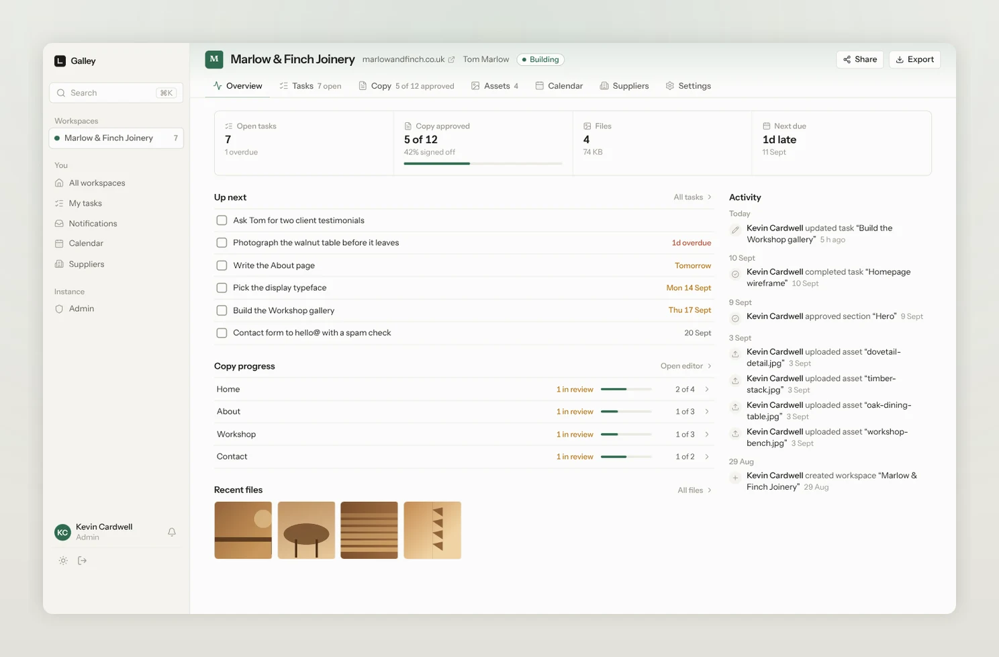
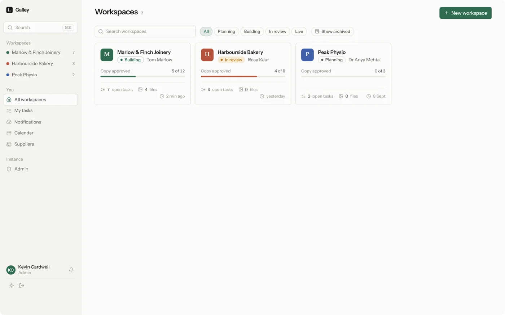
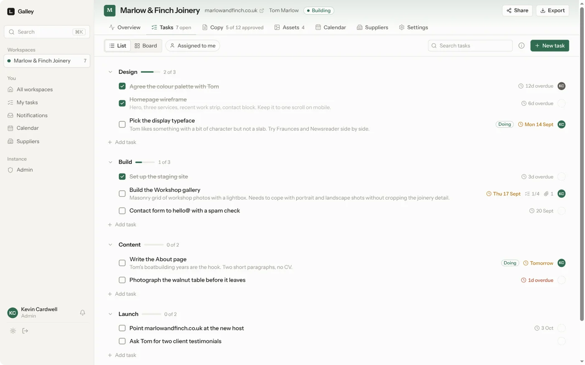
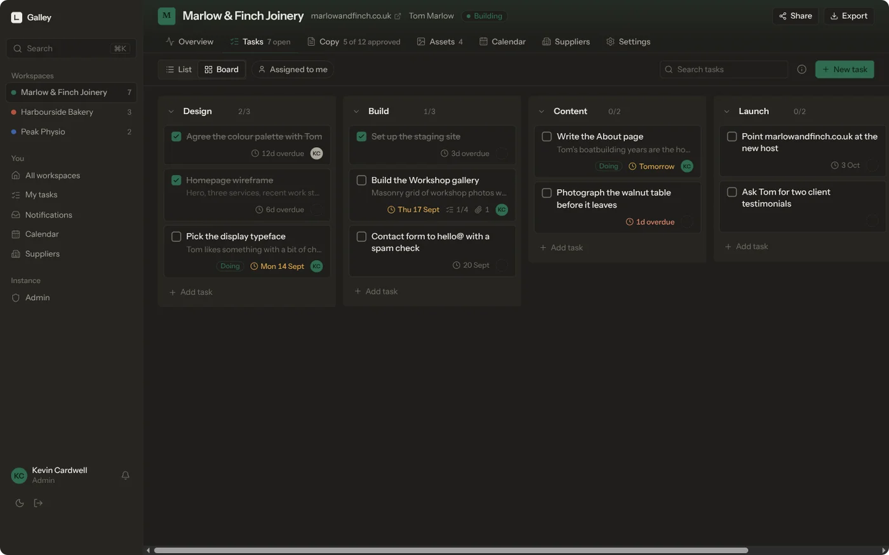
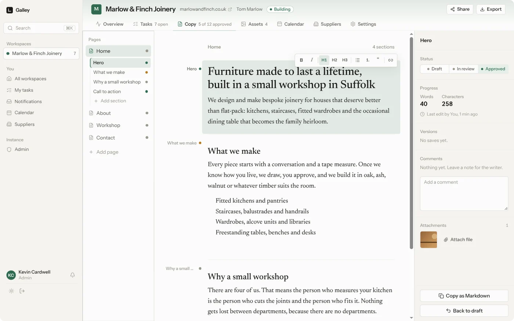
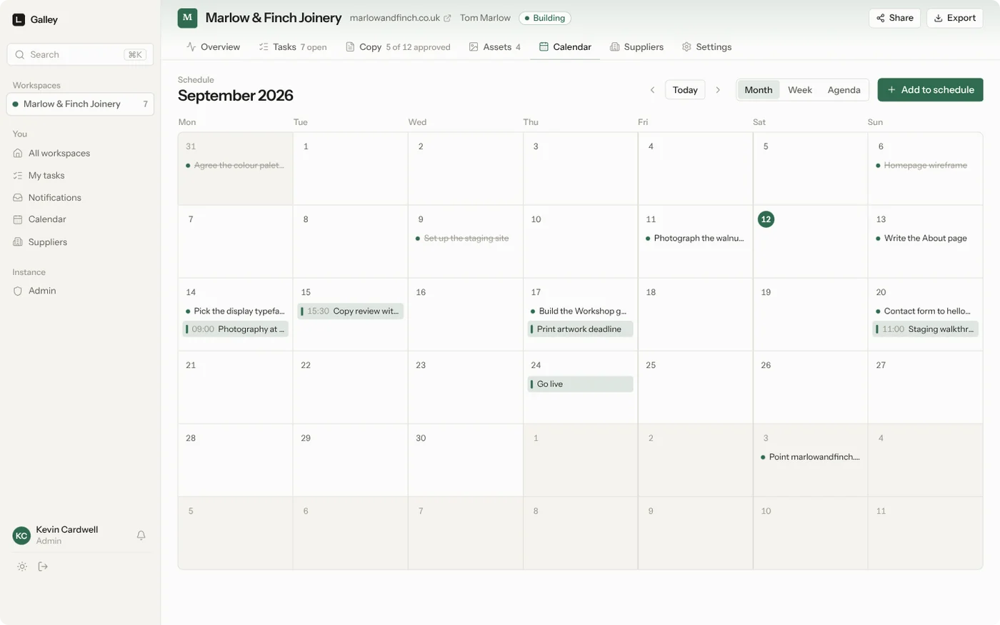
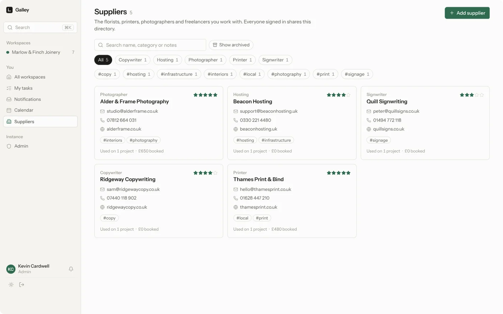
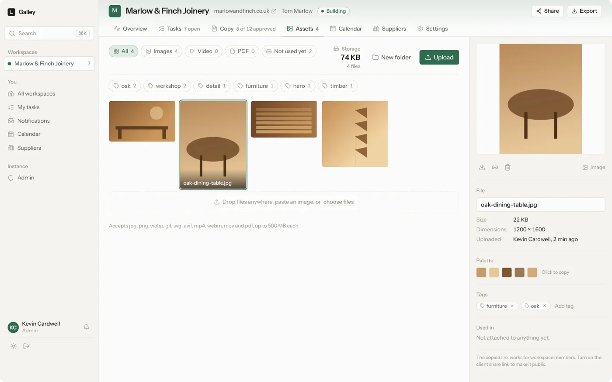
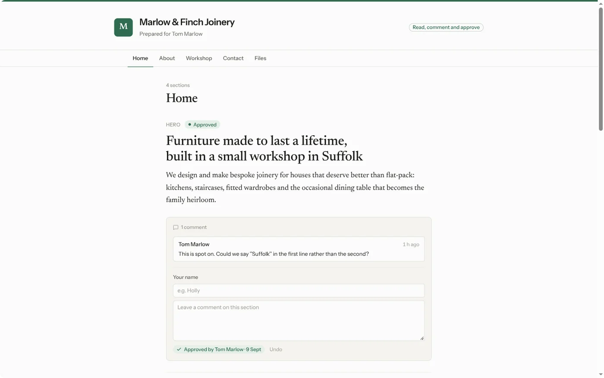
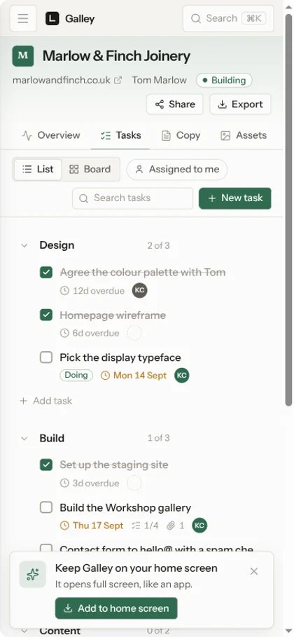

<p align="center">
  
</p>

<h1 align="center">Galley</h1>

<p align="center">
  Tasks, copy, schedules, suppliers and files for every project you run.<br>
  Self-hosted, one container, one file to back up.
</p>

<p align="center">
  <a href="https://github.com/kevincardwell/galley/actions/workflows/ci.yml"></a>
  
  
  
  
</p>

---

A galley proof is the first typeset pull of a page, laid out so the words can be checked before anything goes to print. Galley holds the same things for a project: what needs doing, what it will say, who you are hiring, when it happens, and the pictures that go with it.

It is built for the person who runs the work: a web designer with six client sites on the go, a studio lead, someone organising an event. One screen per project, no seats to buy, no data leaving your server.

```bash
mkdir galley && cd galley
curl -O https://raw.githubusercontent.com/kevincardwell/galley/main/compose.yml
docker compose up -d
```

Open <http://localhost:3000>, create the admin account, and tick the box to load a worked example so nothing starts empty.

---

## What is inside

### Every project on one page

Open a project and you can see where it has got to: what is overdue, how much of the copy is signed off, how many files there are, and what happened recently.



### Tasks that behave like a to-do list, not a ticketing system

Sections you name yourself, a list or a board, drag to reorder, due dates that go amber then red, assignees, checklists, comments and attached files.





### Copy written where it belongs

Pages and sections, each with its own draft, in review and approved state. Several people can write in the same section at once and see each other's cursors. Every save is kept, so you can compare any version with a word-level diff and put it back. One click copies clean Markdown or HTML for whatever the site is built in.



### A calendar that already knows your deadlines

Task due dates appear automatically next to the things you schedule: site visits, photography, the print deadline, go-live. Month, week and agenda views, drag an entry to move it, and a subscribable feed so a client can follow the plan in their own calendar.



### The people you hire, kept once

A shared directory of printers, photographers, copywriters and freelancers, with what you booked them for on each project and what it cost.



### Files with the detail you actually need

Drag anything in. Thumbnails, dimensions, duration for video, a colour palette pulled from each image, tags, folders, and a record of which task or paragraph each file belongs to.



### A link you can send the client

Read-only by default. Turn on review and they can comment on individual sections and approve them, with no account and nothing to install. You are told the moment they do.



### On your phone, as an app

Add it to the home screen from Safari or Chrome and it opens full screen with its own icon.

<p>
  
</p>

---

## Everything else it does

| | |
|---|---|
| **Invite only** | No public sign-up. The first account is the admin; everyone else is invited and sees only the projects they are added to. |
| **Email** | Your own SMTP server, or Resend, Postmark, SendGrid or Mailgun when your host blocks SMTP ports. Invites send themselves. |
| **Notifications** | An inbox for mentions, assignments and client feedback, with email when a provider is set up. |
| **Search** | `⌘K` across tasks, copy, files and projects, scoped to what you are allowed to see. |
| **Export** | A zip of the whole project: copy as Markdown, tasks as CSV, every original file. |
| **Backups** | One click, or nightly with retention, from the admin panel. |
| **Themes** | Light, dark, or follow the system. |
| **Keyboard** | `?` lists every shortcut. |

---

## Running it

### With Docker

```bash
mkdir galley && cd galley
curl -O https://raw.githubusercontent.com/kevincardwell/galley/main/compose.yml
# set GALLEY_URL in compose.yml
docker compose up -d
```

Images are published for `linux/amd64` and `linux/arm64` on every release:

| Registry | Image |
|---|---|
| GitHub | `ghcr.io/kevincardwell/galley:latest` |
| Docker Hub | `kevincardwell/galley:latest` |

Pin a version with a tag such as `:0.1.0` if you would rather upgrade deliberately.

Data lives in the `galley-data` volume at `/data`. To keep it in a folder instead, change the volume to `- ./data:/data` and make it writable by uid 1000.

Behind a reverse proxy: forward to port 3000, set `GALLEY_URL` to the public https address, and raise the proxy's body limit to at least `MAX_UPLOAD_MB`. The https part matters, because home screen installation needs it.

To build the image yourself, uncomment `build: .` in `compose.yml`.

### Without Docker

Node 22 or newer, plus `ffmpeg` on the PATH if you want poster frames for video.

```bash
git clone https://github.com/kevincardwell/galley.git
cd galley
npm ci
npm run build
GALLEY_DATA_DIR=/srv/galley PORT=3000 npm start
```

### Settings

| Variable | Default | What it does |
|---|---|---|
| `GALLEY_URL` | none | Public address, used for invite links and to mark cookies secure. |
| `GALLEY_DATA_DIR` | `./data`, `/data` in Docker | Where the database and uploads live. |
| `MAX_UPLOAD_MB` | `500` | Largest single upload. |
| `TRUSTED_PROXY_HOPS` | `1` | How many reverse proxies sit in front, so the real client address can be found for rate limiting. |
| `PORT` | `3000` | Port to listen on. |

Email and the backup schedule are set in the app, under Admin, not with environment variables.

### Backing up and upgrading

- **Backup**: Admin → Backups writes a zip of the database and every upload, on demand or nightly. Copying the data directory does the same job.
- **Treat backups as secrets.** The database holds your SMTP password or provider API key in plain text, along with password hashes, session tokens and share links. Store backups somewhere you would store a password.
- **Restore**: stop Galley, unzip a backup into an empty data directory, start it again.
- **Upgrade**: `docker compose pull && docker compose up -d`. Migrations run on start.

---

## How it is built

One process, one SQLite file, one uploads folder. No Postgres, no Redis, no object store, no worker container, because a tool for a handful of people should not need a fleet.

- **Next.js 16** with the App Router and server actions
- **SQLite** through Drizzle, in WAL mode, with FTS5 for search
- **Yjs** for live collaborative editing, carried over server-sent events so there is no second port to proxy
- **sharp** and **ffmpeg** for thumbnails, palettes and poster frames
- **Tailwind v4** with tokens for the light and dark palettes

```bash
npm run dev          # development server
npm test             # unit tests
npm run test:e2e     # end-to-end, after npm run build
npm run lint
npm run db:generate  # after editing src/db/schema.ts
```

`docs/DESIGN.md` is the design direction, `docs/PLAN.md` the original plan, and `docs/STATUS.md` the running log of what is done and what is next.

## Licence

MIT. See [LICENCE](LICENCE).
